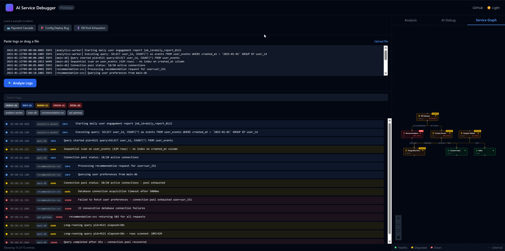
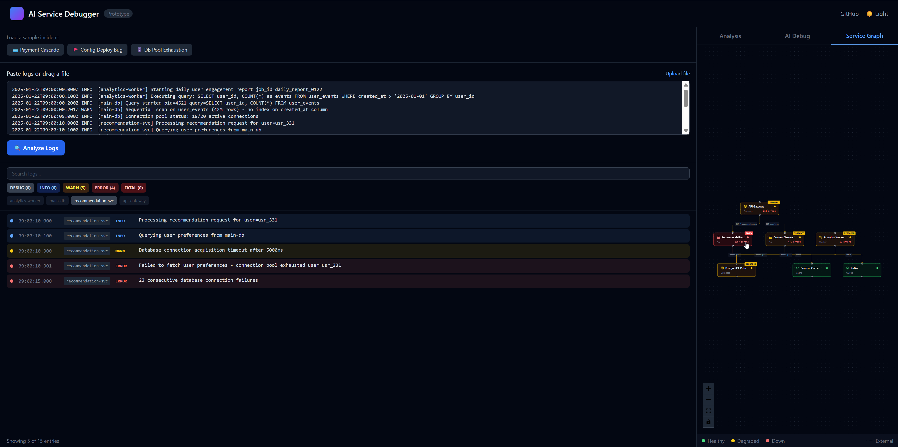
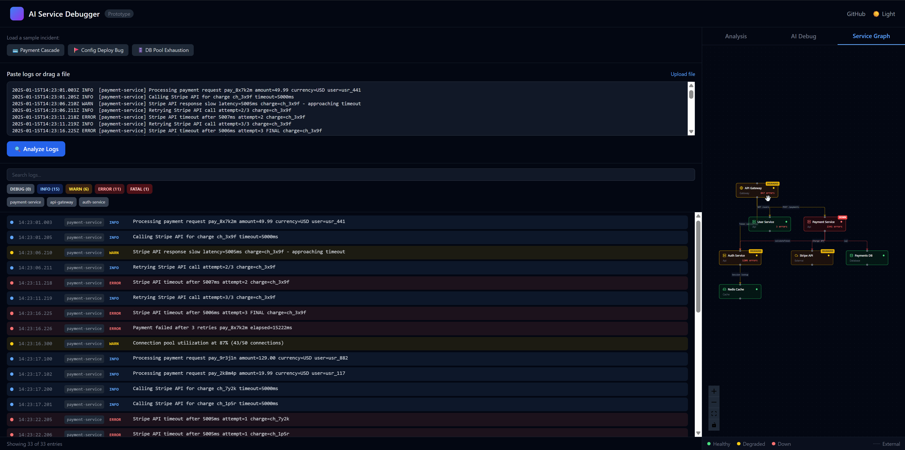

# AI Service Debugger

Production incident debugging tool for microservices. Combines log analysis, service graph visualization, and AI-powered root cause analysis to help SREs investigate failures faster.



## What It Does

- **Parses logs** from multiple formats (ISO+bracket, JSON, syslog)
- **Visualizes service topology** with animated cascade chains showing failure propagation
- **AI analysis** using Claude Sonnet 4.5 to identify root causes, blast radius, and suggested fixes
- **Interactive chat** for follow-up questions about the incident
- **Timeline filtering** by severity, service, and time range with cross-panel interactions

Built to demonstrate clean React/TypeScript architecture and thoughtful AI integration for developer productivity tools.

## Tech Stack

**Frontend**
- React 18 + TypeScript + Vite
- Zustand (state management)
- Tailwind CSS (styling)
- React Flow + Dagre (service graph visualization)
- react-markdown + remark-gfm (AI response formatting)

**Backend**
- Node.js + Express + TypeScript
- Anthropic Claude API (claude-sonnet-4-5-20250514)
- Multi-format log parser

## Running Locally

**Prerequisites:** Node.js 18+, npm, Anthropic API key

```bash
# 1. Clone and install
git clone https://github.com/2bxtech/ai-service-debugger.git
cd ai-service-debugger

# 2. Server setup
cd server
cp .env.example .env
# Add your ANTHROPIC_API_KEY to .env
npm install
npm run dev

# 3. Client setup (new terminal)
cd client
npm install
npm run dev
```

Visit `http://localhost:5173`

## Sample Scenarios

Three realistic incident scenarios included:

1. **Payment Timeout Cascade** - Retry storm overwhelming auth service
2. **Config Deploy Bug** - Feature flag causing null reference errors
3. **DB Pool Exhaustion** - Unindexed analytical query blocking connections

## Features

### Log Timeline


- Multi-format log parsing
- Severity and service filtering
- Time range selection
- Error count summaries

### Service Graph


- Automatic layout of microservice topology
- Status-based color coding (healthy/degraded/down)
- Animated cascade chains showing failure propagation
- Hover to filter timeline logs by service

### AI Analysis


- Root cause identification
- Cascade chain breakdown
- Blast radius estimation
- Actionable remediation steps
- Follow-up chat for deeper investigation

### Cross-Panel Interactions
- Hover service graph node → filters timeline to that service's logs
- Keyboard shortcuts (Cmd/Ctrl+K search, Cmd/Ctrl+Enter analyze, Cmd/Ctrl+Shift+C chat)
- Error boundaries isolate panel failures
- Responsive layout for mobile/tablet

## Architecture

```
client/src/
  ├── components/    # React components (Timeline, ServiceGraph, Chat, etc.)
  ├── stores/        # Zustand stores (logStore, chatStore, incidentStore, etc.)
  ├── types/         # TypeScript definitions
  └── hooks/         # Custom hooks (keyboard shortcuts, etc.)

server/src/
  ├── routes/        # Express endpoints (parse, analyze, samples)
  ├── services/      # Anthropic integration, prompt building
  └── data/          # Sample incident JSON files
```

**Data flow:** User loads sample → Parse logs → Display timeline → AI analysis → Service graph visualization → Interactive chat

## Project Status

- ✅ Phase 1: Full-stack infrastructure, log parsing, AI integration
- ✅ Phase 2: Service graph visualization with cascade animation
- ✅ Phase 3: UX polish (markdown, error boundaries, keyboard shortcuts, responsive design)
- 🚧 Phase 4: Deployment (Vercel + Railway/Render)

**Documentation:** See [docs/](./docs/) for detailed retrospectives on each development phase.

## Development Notes

**Environment variables:**
- Server: `ANTHROPIC_API_KEY`, `PORT` (default 3001), `CLIENT_URL`
- Client: `VITE_API_URL` (default http://localhost:3001/api)

**No persistence:** All state is ephemeral (no localStorage or database). Load a sample scenario to start.

**Anthropic costs:** ~$0.01-0.03 per analysis with Claude Sonnet 4.5. The API requires a $5 minimum credit purchase.

## License

MIT

---

**Portfolio Project** - Built to demonstrate React/TypeScript proficiency, AI integration depth, and understanding of distributed systems debugging workflows. Not production-ready for actual incident response.
